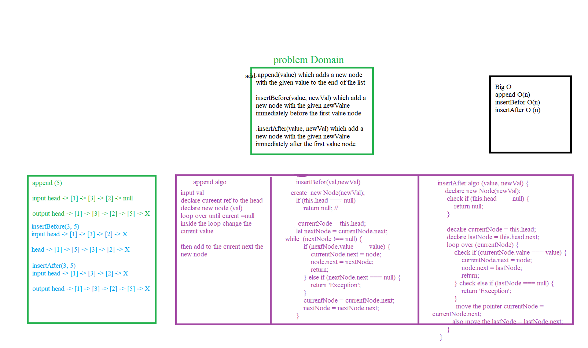
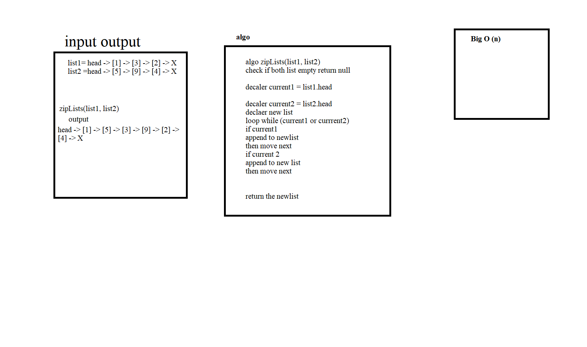

# Singly Linked List

It's one of the LinkedList Type so it mean we have one reference to the next node. 

## Challenge

create three method into the class Linked List

1. `insert` which takes any value as an argument and adds a new node with that value to the head of the list.
2. `includes` which takes any value as an argument and returns a boolean result depending on whether that value exists as a Node’s value somewhere within the list.

3. `toString` which takes in no arguments and returns a string representing all the values in the Linked List, formatted as: `"{ a } -> { b } -> { c } -> NULL"`

## Approach & Efficiency

two class's one for the node it self have two attrubite one for the val and the secound for the pointer called next  and another for the linked list to connect the node to each other inside the constractor there is a head to  point to the first node 

## API

1. `insert`   : Insert at the beginning of the linked list .
2. `includes` : Search if the value we recived found on our linked list.
3. `toString` : Return the all value in our linked list as a String.
4. `append`   : add new node to the linked list .
5. `.insertBefore(value, newVal)` : insert befor the value that we send
6. `.insertAfter(value, newVal)` :insert after the value
7. `.kthFromEnd(k)` : return the index of the list reversly
8. `ziplist(list1,list2)` : return the list as ziq zag thing  

.png)
