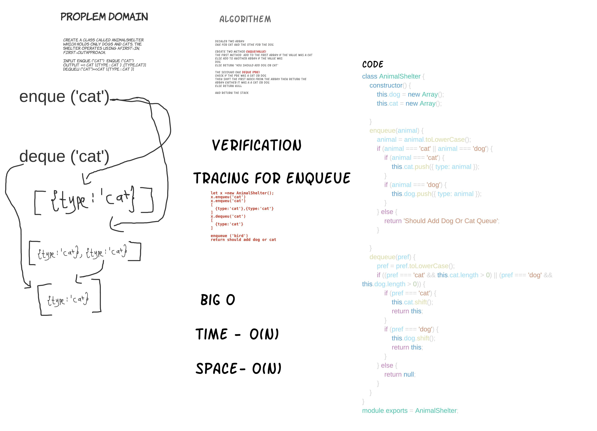

# Fifo-animal-shelter.

## Challenge 11 

### Implement FIFO using `AnimalShelter ` calss

1. Define a method called `enqueue(value)` which takes `cat or dog` as an argument and then push it to the cat Or dog  array depend on the `value`
2. Define a method called `dequeue(pref)` which  takes  `cat or dog` as an argument then `shift` (remove) the first index the return the array 

## Approach & Efficiency

one class with two array decalerd in the constarctor add to them depend on the value we recevied

