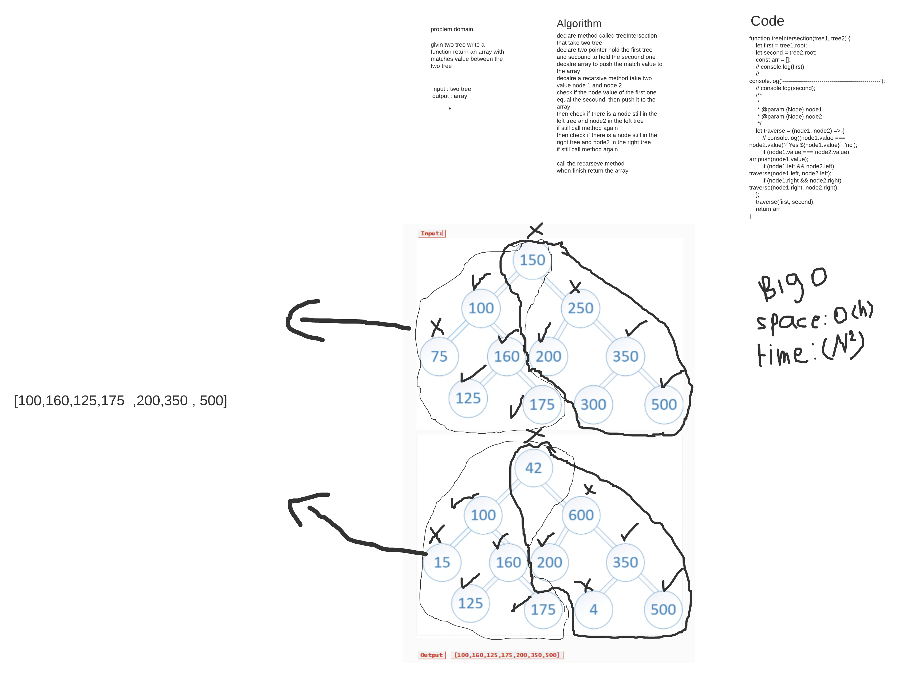

# Challenge Summary
<!-- Description of the challenge -->
givin two tree write a function return an array with matches value between the two tree 

## Whiteboard Process
<!-- Embedded whiteboard image -->


## Solution

```
 clone the repo
 cd to it 
 then npm i 
 then run the test npm test treeIntersection
 or go to java script file and see the code  
```

