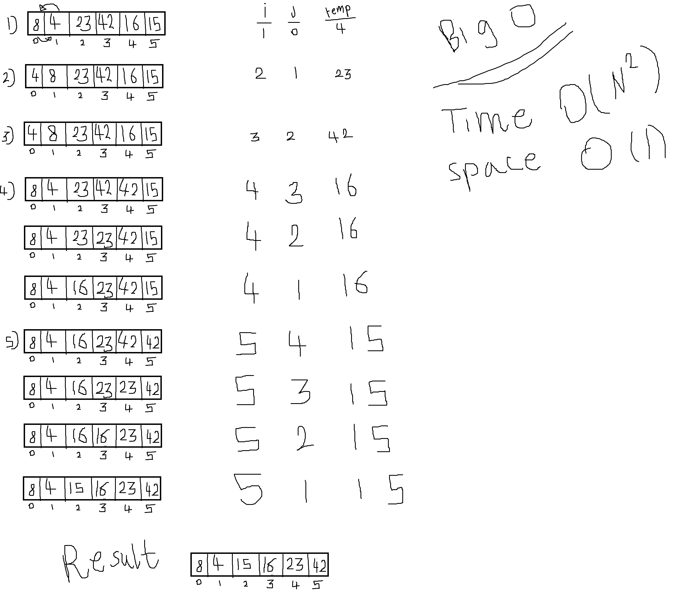

# Insertion Sort 

Insertion sort is a simple sorting algorithm that works similar to the way you sort playing cards in your hands. The array is virtually split into a sorted and an unsorted part. Values from the unsorted part are picked and placed at the correct position in the sorted part.

--------

## Algorithm 
1. loop over the array start from the index 1
2. decaler var called j with the value of i -1 
3. create temporery var and give them the index of i 
4. loop again untill j greater than or equal zero and temp less than the arr of j 
5. start move the sorted value to the main array 
6. return arr


-------

### Code 

```
const insertionSort = (arr) => {
    for (let i = 1; i < arr.length; i++) {
        let j = i - 1;
        let temp = arr[i];
        while (j >= 0 && temp < arr[j]) {
            arr[j + 1] = arr[j];
            j = j - 1;
        }
        arr[j+1]=temp;
    }
    return arr;

};


module.exports=insertionSort;

```

--------

#### Trace



