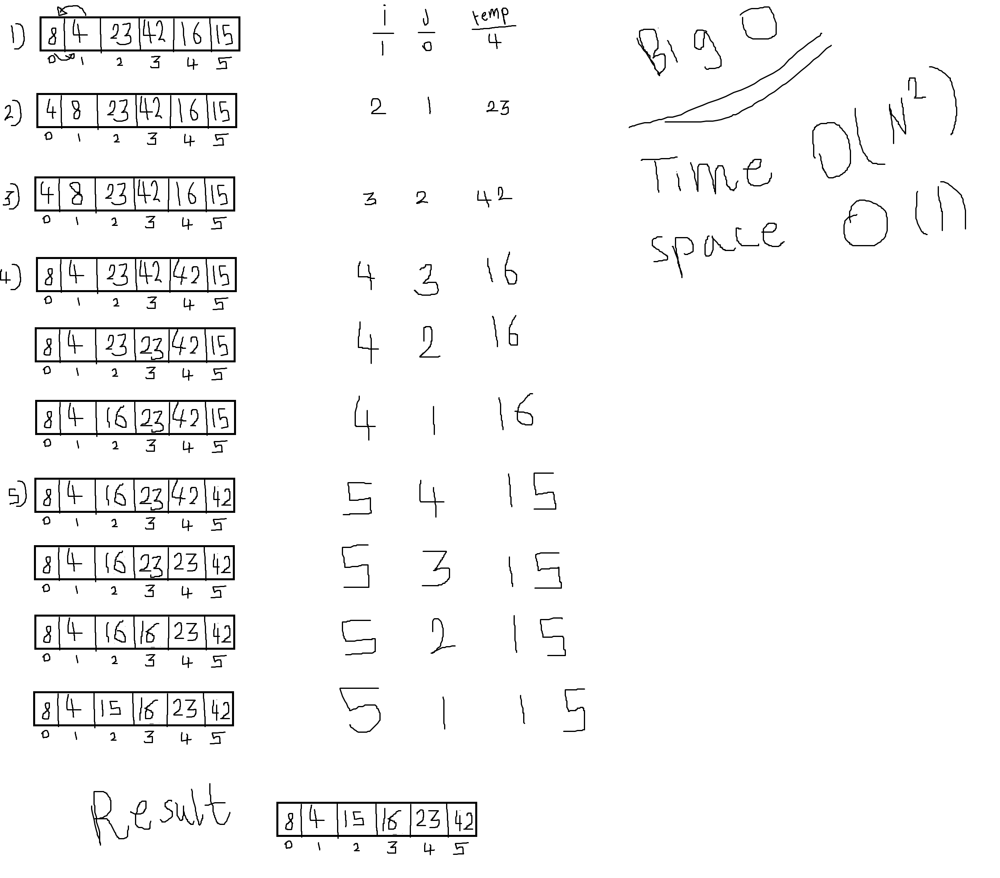

# Challenge Summary
<!-- Description of the challenge -->
 Return an array with elements in sorted. without using any bulit in method

## Whiteboard Process
<!-- Embedded whiteboard image -->


## Solution

```
 clone the repo
 cd to it 
 then npm i 
 then run the test npm test multiBracketValidation
 or go to java script file and see the code  
```

