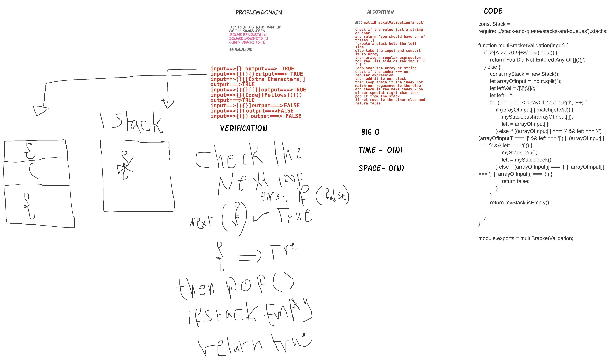

# Challenge Summary
<!-- Description of the challenge -->
 function to tests if a string made up of this characters
   - Round Brackets : `()`
   - Square Brackets : `[]`
   - Curly Brackets : `{}` 

is balanced.


## Whiteboard Process
<!-- Embedded whiteboard image -->


## Approach & Efficiency
store the input in array 
the loop over input array  
then I make a regex to take the left side of the input
then store it into stack 
then start balncing the input 
## Solution

```
 clone the repo
 cd to it 
 then npm i 
 then run the test npm test multiBracketValidation
 or go to java script file and see the code  
```

