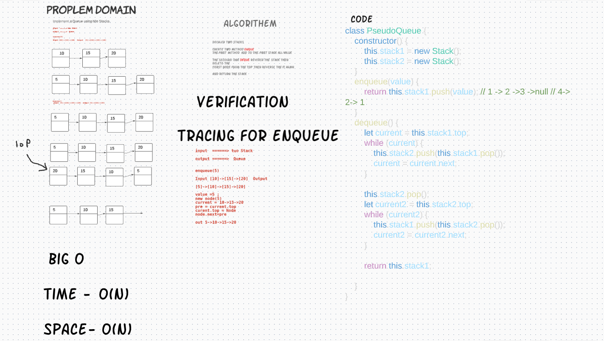

# Implement a Queue using two Stacks.

## Challenge 11 

### Implement a Queue using two Stacks.

-----------------------

### Create a `Stack` class that has a top property. It creates an empty Stack when instantiated.

This object should be aware of a default empty value assigned to top when the stack is created.

1. Define a method called `push` which takes any value as an argument and adds a new node with that value to the top of the stack with an O(1) Time performance.

2. Define a method called `pop` that does not take any argument, removes the node from the top of the stack, and returns the node’s value.
Should raise exception when called on empty stack
3. Define a method called `peek` that does not take an argument and returns the value of the node located on top of the stack, without removing it from the stack.
Should raise exception when called on empty stack
4. Define a method called `isEmpty` that takes no argument, and returns a boolean indicating whether or not the stack is empty.

-----------------------

### Implement a Queue using two Stacks. `PseudoQueue `

1. Define a method called `enqueue` which takes any value as an argument and then add it to the first stack
2. Define a method called `dequeue` that does not take any argument,make a while loop to reverse the stack 1 and push it on the stack 2  then `pop()`
the top of the stack 2 
then reverse it again and send the stack1 after poping the top  

## Approach & Efficiency

three  class's one for the node it self have two attrubite one for the val and the secound for the pointer called next  and another for the Stack list to connect the node to each other inside the constractor there is a head to  point to the first node

