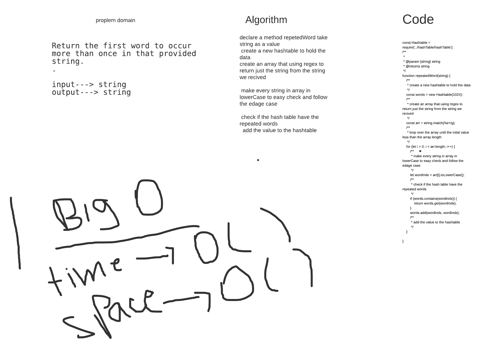

# Challenge Summary
<!-- Description of the challenge -->
Return the first word to occur more than once in that provided string.

## Approach & Efficiency
<!-- What approach did you take? Why? What is the Big O space/time for this approach? -->

## Solution

## Whiteboard Process
<!-- Embedded whiteboard image -->
